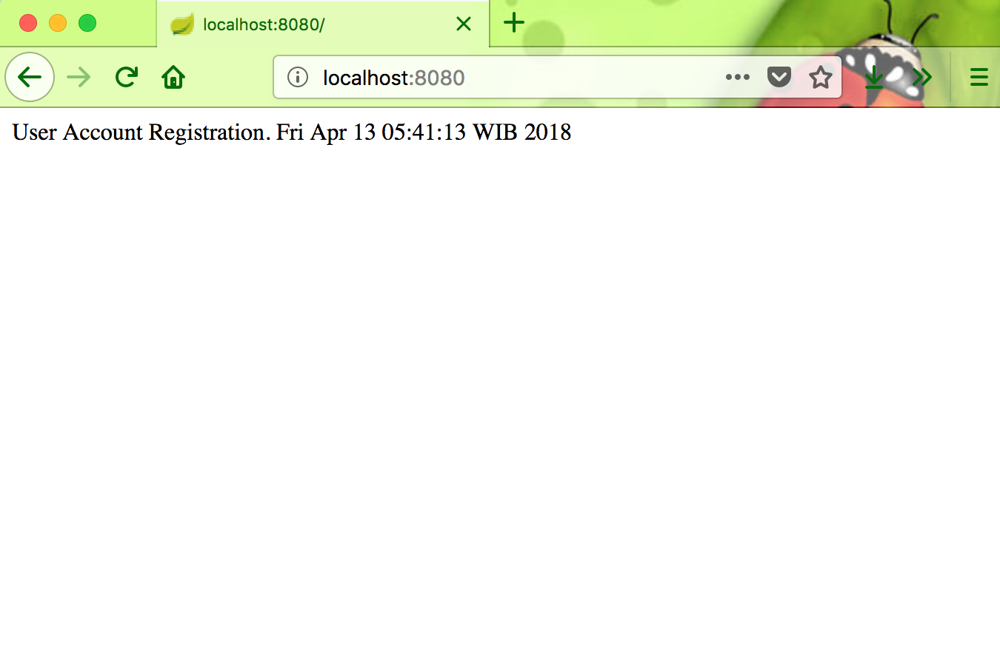
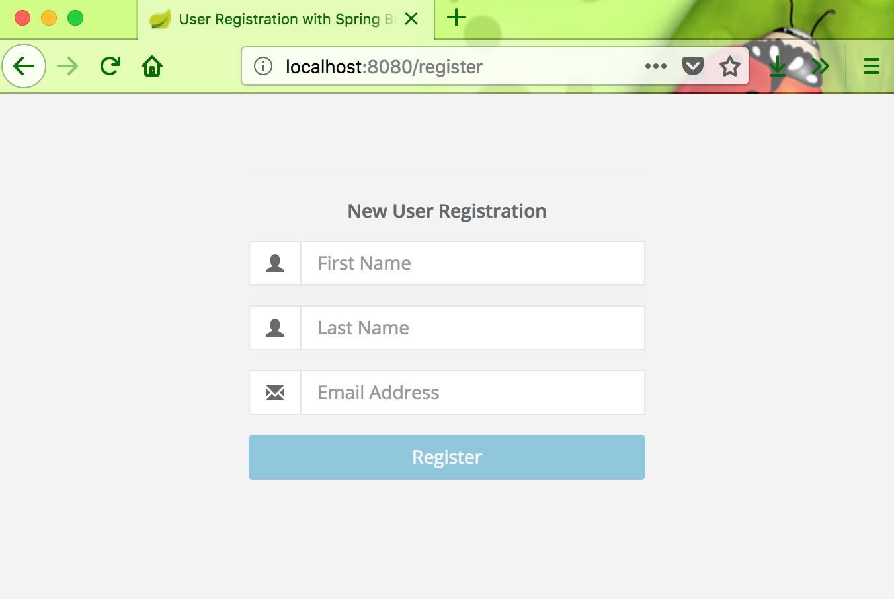
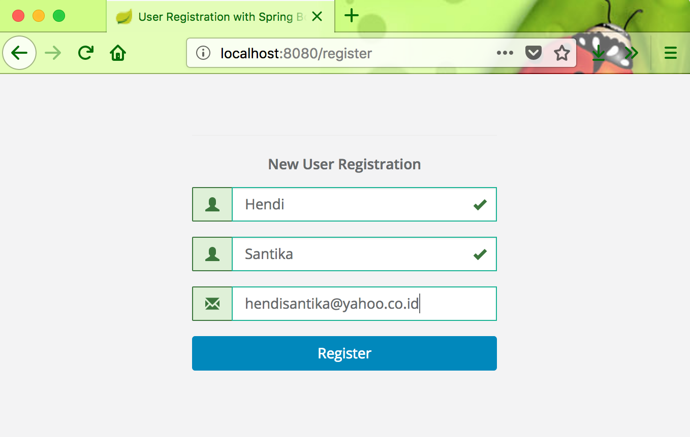

# User Account Registration

### A simple example about user account registration using Spring Boot

To run this project :

1. Change username & password properties with your username & password email in application.properties file.
2. Type or copy paste this --> `mvn clean spring-boot:run` on your terminal.

3. Open your browser then go this link to register : `http://localhost:8080/register`

4. Open your email then click the link to confirm : `http://localhost:8080/confirm`